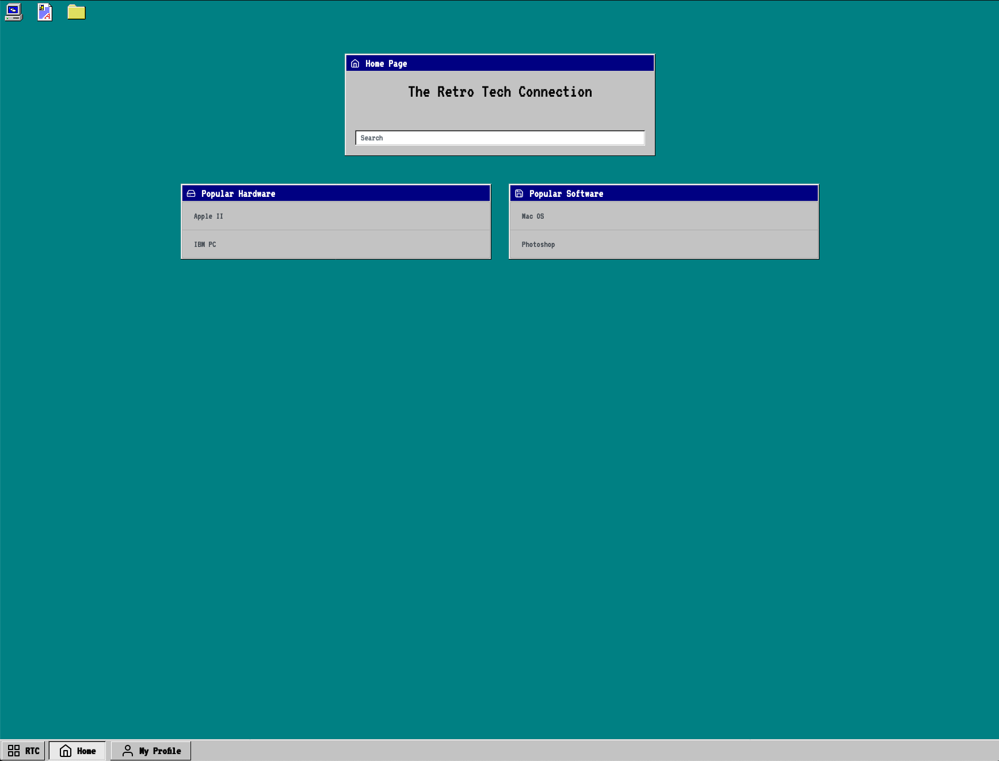
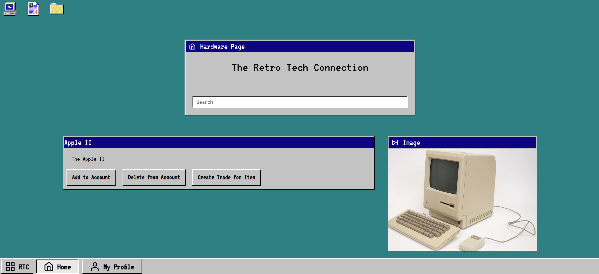
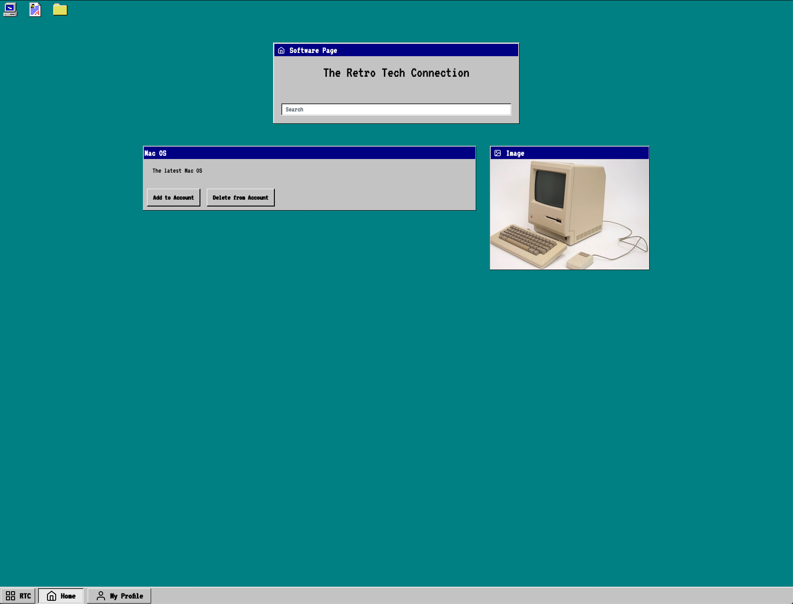
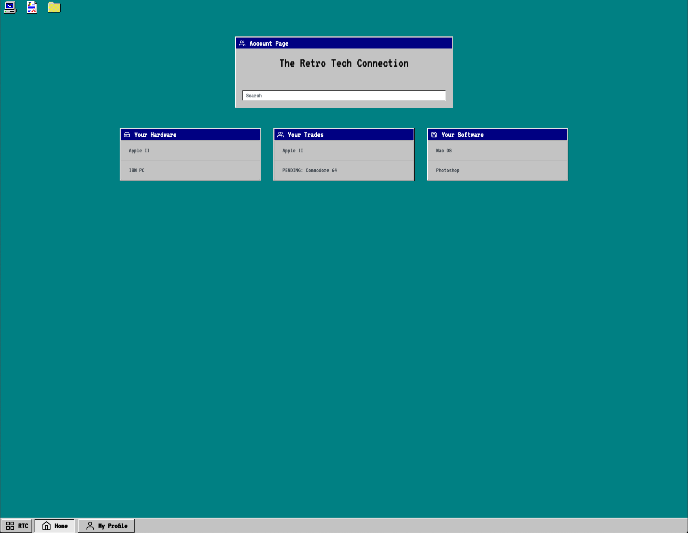

The Retro Tech Connection REST API
===================================

Authentication
--------------
```/login```<br/>
```/register```

Login will create a POST request submitting username and password - assuming the information submitted is valid - the user will be returned an authentication token.

Register must check that the username and email submitted are unique - should then store these values using a POST request, and return the user an authentication token (log them in).

CREATE API
----------
### Overview ###
POST requests that facilitate the creation or updating of objects.

### REST Calls ###
```POST /api/hardware``` 

Create a new piece of hardware.<br/>


```POST /api/software```


Create a new piece of software.<br/>

```POST /api/media``` 

Create a new piece of media.<br/>


```POST /api/tag```

Creates a new tag.<br/>


```POST /api/user```

Create a new user.

```POST /api/trade```

Create a new trade.


READ API
--------
### Overview ###
GET requests that facilitate the viewing of information about objects. Specific GET requests for Media should not be needed because media will be retrieved with the associated hardware/software.

### REST Calls ###
```GET /api/user/[id]```

View a user account/profile.<br/>


```GET /api/user/[id]/software```

Get single piece of hardware that is associated with user.<br/>


```GET /api/user/[id]/hardware```

Get single piece of hardware that is associated with user.<br/>


```GET /api/hardware?sort=popular&page=2```

Gets list of hardware (paginated, can also be sorted for display on the front page).<br/>


```GET /api/software?sort=popular&page=1```

Gets list of software (paginated/sorted)<br/>


```GET /api/hardware/[id]```

Gets single piece of hardware.<br/>


```GET /api/software/[id]```

Gets a single piece of software.<br/>


```GET /api/media/[id]```

Gets a single piece of media.<br/>

```GET /api/softwaremedia/[id]```

Gets an ID (if any) of media related to the passed software ID.<br/>

```GET /api/hardwaremedia/[id]```

Gets an ID (if any) of media related to the passed hardware ID.<br/>

```GET /api/tag/[name]```

View the results associated with a tag beings searched.

```GET /api/trade/:tradeId```

Returns a trade with the given tradeId.

```GET /api/user/:userId/trade```

Returns all of a User's trades.

UPDATE API
-----------
```POST /api/user/[id]/hardware```

Update a User with a new piece of assocaited hardware.<br/>


```POST /api/user/[id]/software```

Update a User with a new piece of associated software.<br/>

```POST /api/trade/:tradeId/accept```

Updates a trade to the be in the accepted state.

DELETE API
-----------
### Overview ###
DELETE requests that facilitate the deletion of objects.

### REST Calls ###
```DELETE /api/user/[user:id]/hardware/[hardware:id]```

Delete a piece of hardware from a user account.<br/>


```DELETE /api/user/[user:id]/software/[software:id]```

Delete a piece of software from a user account.<br/>


```DELETE /api/media/[id]```

Delete media (should look for references and delete from that content).

```DELETE /api/trade/:tradeId```

Delete's a trade (to be called when a trade is rejected).

HEROKU URL
-----------
https://retrotechconnection.herokuapp.com/#

POSTMAN URL
-----------
https://documenter.getpostman.com/view/9923727/Szf3ZVRs?version=latest </br>
Note: not all API calls are logged in Postman as of submission.

DIVISION OF LABOR
-----------------
### Will Hammond ###
Implemented all of the funcitonality needed for trades (including entity, views, HTML pages, and API)</br>
Styled webpages</br>
Wrote API calls and routing</br>
Tested API</br>


### Dan Walsh ###
Setup Heroku deployment, automated deployment</br>
Created views to allow for dynamic data on homepage, user account page</br>
Further styled webpages</br>
Setup routing with Express</br>

### Jackson Weber ###
Drew out API Planning/drafted original API</br>
Created Controller setup</br>
Created Original entities</br>
Setup Gulp to compile both frontend and backend with single command (for Heroku/ease)</br>
Created AbstractView system to manage frontend state change</br>
Built initial routing setup.</br>

PAGE SCREENSHOTS
-----------------

The homepage allows users to see lists of both popular software and hardware. From these lists, the user can click on any piecce of software or hardware and be redirected to their corresponding information pages. The Homepage also includes a search functionality that returns specific hardware or software.</br>


The hardware page allows users to see information associated with a piece of hardware, as well as associated images of links. From this page, the user can choose to add or delete the hardware from their account, as well as create a new trade for the item.


The software page allows users to see information associated with a piece of software, as well as associated images or links. From this page the user can also choose to add the software from their account, or delete it.</br>


The account page allows users to see a list of their currently owned hardware and software as well as both their accepted and pending trades. 
